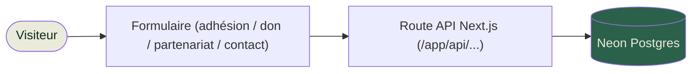

<div align="center">


*« Façonnons l'Avenir Ensemble »*


</div>

## Présentation

Ce dépôt contient le site vitrine de l'**ASEGUIM** (Association des Stagiaires et Étudiants Guinéens au Maroc) : présentation de l'association, de ses domaines d'action, de son Bureau Exécutif Central et de son Conseil Consultatif, et parcours d'adhésion / don / partenariat. Les formulaires soumettent directement en base (Neon Postgres serverless) via des routes API internes — pas de maquette, les demandes sont réellement enregistrées.

## Comment ça marche



Chaque formulaire (`AdhesionForm`, `DonForm`, `PartenaireForm`) poste vers sa route API dédiée (`src/app/api/adhesion`, `/don`, `/partenariat`), qui insère la soumission dans la table correspondante via `@neondatabase/serverless`.

## Stack


- **Next.js 16** (App Router, React 19, TypeScript strict)
- **Tailwind CSS v4** — design tokens dans `globals.css` (palette ASEGUIM : `--green-700`, `--cream`, `--ink`, `--yellow`, `--orange`)
- **Neon** (`@neondatabase/serverless`) pour la persistance des formulaires
- **Lenis** (smooth scroll) · animations d'apparition maison (IntersectionObserver)
- **lucide-react** (icônes) · **shadcn / base-ui** (primitives UI)
- **Playwright** pour l'audit visuel (`scripts/mobile-audit.mjs`, `scripts/scroll-shots.mjs`)

## Démarrage

```bash
npm install
npm run dev        # http://localhost:3000
```

Variables d'environnement requises (`.env`) :

```
DATABASE_URL=postgresql://...   # instance Neon
```

Initialiser les tables (adhésions, dons, partenariats) :

```bash
node scripts/init-db.mjs
```

Autres commandes : `npm run build`, `npm run start`, `npm run lint`, `npm run typecheck`, `npm run check`.
Node **≥ 24** requis.

<details>
<summary><b>Structure du dépôt</b></summary>

<br/>

```
src/
  app/
    page.tsx                # Accueil
    api/                     # adhesion/ don/ partenariat/ — routes Neon
    qui-sommes-nous/  bureau-executif/  nos-domaines/
    commission-scientifique/  conseil-consultatif/  talents/
    adhesion/  don/  devenir-partenaire/  contact/  legal/
  components/
    ui/                     # Primitives : Logo, Pill, Reveal, SmoothScroll
    layout/                 # Navbar, Footer
    sections/               # Sections de l'accueil (Hero, Mission, Domaines, Chiffres…)
    forms/                  # Adhésion, Don, Partenaire, Contact
    shared/                 # PageHeader, SectionHeading, CtaBanner, TeamCard, OrgConnector, LegalPage
  data/aseguim.ts            # Toutes les données de l'association (source unique)
  hooks/useCountUp.ts         # Compteurs animés
  lib/db.ts                   # Client Neon (sql`...`)
  lib/utils.ts                # cn()
public/aseguim/
  images/                     # logo + partenaires + domaines + bureau-2026
  videos/                     # bannière vidéo
scripts/
  init-db.mjs                 # Création des tables Neon
  mobile-audit.mjs             # Audit responsive (Playwright)
  scroll-shots.mjs              # Captures de scroll (Playwright)
```

</details>

<details>
<summary><b>Contenu et Bureau Exécutif</b></summary>

<br/>

Tout le contenu (identité, mission, domaines, chiffres, partenaires, bureau exécutif, commissions, conseil consultatif, talents, contact, bureaux régionaux, réseaux) est centralisé dans **`src/data/aseguim.ts`** — un seul fichier à éditer pour mettre à jour le site.

La page `/bureau-executif` affiche le bureau sous forme d'organigramme : le Secrétaire Général en avant (`TeamCard` avec `featured`), relié par des connecteurs animés (`OrgConnector.tsx`, SVG + `stroke-dashoffset`) à deux rangées de trois membres. Les photos du BEC en cours sont locales, dans `public/aseguim/images/bureau-2026/`. Pour changer d'équipe : mettre à jour le tableau `BUREAU` dans `src/data/aseguim.ts` (un seul membre avec `featured: true`, les six autres suivent dans l'ordre d'affichage) et déposer les nouvelles photos dans le même dossier.

</details>

<div align="center">


</div>
